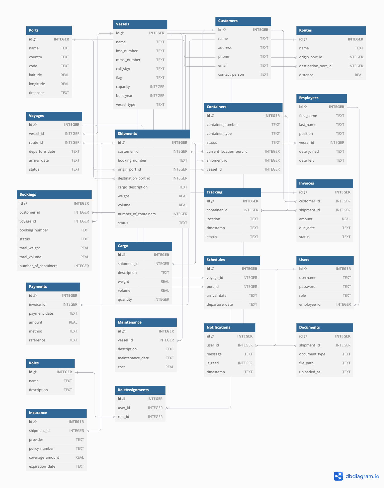

# Base de Datos para Aplicación de Logística Marítima

Este documento proporciona una descripción detallada de la base de datos diseñada para una API de logística marítima desarrollada con Python, utilizando SQLite como sistema de gestión de bases de datos. La base de datos está estructurada para gestionar eficientemente puertos, barcos, rutas, viajes, clientes, envíos, contenedores, empleados y otros componentes clave del negocio marítimo.

## Tabla de Contenidos

- [Introducción](#introducción)
- [Esquema de la Base de Datos](#esquema-de-la-base-de-datos)
  - [Diagrama ER](#diagrama-er)
  - [Descripción de Tablas y Relaciones](#descripción-de-tablas-y-relaciones)
- [Detalles de las Tablas](#detalles-de-las-tablas)
  - [1. Ports (Puertos)](#1-ports-puertos)
  - [2. Vessels (Barcos)](#2-vessels-barcos)
  - [3. Customers (Clientes)](#3-customers-clientes)
  - [4. Routes (Rutas)](#4-routes-rutas)
  - [5. Voyages (Viajes)](#5-voyages-viajes)
  - [6. Shipments (Envíos)](#6-shipments-envíos)
  - [7. Containers (Contenedores)](#7-containers-contenedores)
  - [8. Employees (Empleados)](#8-employees-empleados)
  - [9. Bookings (Reservas)](#9-bookings-reservas)
  - [10. Cargo (Carga)](#10-cargo-carga)
  - [11. Tracking (Seguimiento)](#11-tracking-seguimiento)
  - [12. Invoices (Facturas)](#12-invoices-facturas)
  - [13. Payments (Pagos)](#13-payments-pagos)
  - [14. Maintenance (Mantenimiento)](#14-maintenance-mantenimiento)
  - [15. Schedules (Horarios)](#15-schedules-horarios)
  - [16. Users (Usuarios)](#16-users-usuarios)
  - [17. Roles (Roles)](#17-roles-roles)
  - [18. RoleAssignments (Asignaciones de Roles)](#18-roleassignments-asignaciones-de-roles)
  - [19. Notifications (Notificaciones)](#19-notifications-notificaciones)
  - [20. Documents (Documentos)](#20-documents-documentos)
  - [21. Insurance (Seguros)](#21-insurance-seguros)
- [Instrucciones de Configuración](#instrucciones-de-configuración)
- [Consideraciones de Seguridad](#consideraciones-de-seguridad)
- [Contribuciones](#contribuciones)
- [Licencia](#licencia)

---

## Introducción

Esta base de datos está diseñada para soportar todas las operaciones necesarias en una aplicación de logística marítima. Gestiona información sobre puertos, barcos, rutas marítimas, viajes, clientes, envíos, contenedores, empleados, reservas, seguimiento de carga y más.

El objetivo es proporcionar una estructura sólida y escalable que permita a la aplicación manejar de manera eficiente y efectiva las complejidades de la logística marítima.

## Esquema de la Base de Datos

### Diagrama ER

### Descripción de Tablas y Relaciones

La base de datos consta de 21 tablas principales, cada una representando una entidad clave en el dominio de la logística marítima. Las tablas están interconectadas mediante claves foráneas para representar las relaciones entre entidades, como se detalla a continuación.

---

## Detalles de las Tablas

### 1. Ports (Puertos)

Almacena información sobre los puertos marítimos.

- **Campos:**
  - `id` (INTEGER, PK): Identificador único del puerto.
  - `name` (TEXT): Nombre del puerto.
  - `country` (TEXT): País donde se encuentra el puerto.
  - `code` (TEXT, UNIQUE): Código único del puerto.
  - `latitude` (REAL): Latitud geográfica.
  - `longitude` (REAL): Longitud geográfica.
  - `timezone` (TEXT): Zona horaria del puerto.

### 2. Vessels (Barcos)

Contiene información sobre los barcos que realizan los viajes.

- **Campos:**
  - `id` (INTEGER, PK): Identificador único del barco.
  - `name` (TEXT): Nombre del barco.
  - `imo_number` (TEXT, UNIQUE): Número IMO del barco.
  - `mmsi_number` (TEXT, UNIQUE): Número MMSI del barco.
  - `call_sign` (TEXT): Indicativo de llamada.
  - `flag` (TEXT): Bandera del barco.
  - `capacity` (INTEGER): Capacidad en TEUs.
  - `built_year` (INTEGER): Año de construcción.
  - `vessel_type` (TEXT): Tipo de barco.

### 3. Customers (Clientes)

Almacena información sobre los clientes que utilizan los servicios.

- **Campos:**
  - `id` (INTEGER, PK): Identificador único del cliente.
  - `name` (TEXT): Nombre o razón social del cliente.
  - `address` (TEXT): Dirección.
  - `phone` (TEXT): Teléfono.
  - `email` (TEXT): Correo electrónico.
  - `contact_person` (TEXT): Persona de contacto.

### 4. Routes (Rutas)

Define las rutas marítimas entre puertos.

- **Campos:**
  - `id` (INTEGER, PK): Identificador único de la ruta.
  - `name` (TEXT): Nombre de la ruta.
  - `origin_port_id` (INTEGER, FK): Puerto de origen.
  - `destination_port_id` (INTEGER, FK): Puerto de destino.
  - `distance` (REAL): Distancia en millas náuticas.

### 5. Voyages (Viajes)

Registra los viajes que realizan los barcos en ciertas rutas.

- **Campos:**
  - `id` (INTEGER, PK): Identificador único del viaje.
  - `vessel_id` (INTEGER, FK): Barco que realiza el viaje.
  - `route_id` (INTEGER, FK): Ruta que sigue el viaje.
  - `departure_date` (TEXT): Fecha de salida.
  - `arrival_date` (TEXT): Fecha de llegada.
  - `status` (TEXT): Estado del viaje.

### 6. Shipments (Envíos)

Representa los envíos que hacen los clientes.

- **Campos:**
  - `id` (INTEGER, PK): Identificador único del envío.
  - `customer_id` (INTEGER, FK): Cliente que realiza el envío.
  - `booking_number` (TEXT, UNIQUE): Número de reserva del envío.
  - `origin_port_id` (INTEGER, FK): Puerto de origen.
  - `destination_port_id` (INTEGER, FK): Puerto de destino.
  - `cargo_description` (TEXT): Descripción de la carga.
  - `weight` (REAL): Peso total.
  - `volume` (REAL): Volumen total.
  - `number_of_containers` (INTEGER): Número de contenedores.
  - `status` (TEXT): Estado del envío.

### 7. Containers (Contenedores)

Almacena información sobre los contenedores utilizados en los envíos.

- **Campos:**
  - `id` (INTEGER, PK): Identificador único del contenedor.
  - `container_number` (TEXT, UNIQUE): Número único del contenedor.
  - `container_type` (TEXT): Tipo de contenedor.
  - `status` (TEXT): Estado del contenedor.
  - `current_location_port_id` (INTEGER, FK): Ubicación actual.
  - `shipment_id` (INTEGER, FK): Envío al que está asignado.
  - `vessel_id` (INTEGER, FK): Barco en el que se encuentra.

### 8. Employees (Empleados)

Registra la información de los empleados.

- **Campos:**
  - `id` (INTEGER, PK): Identificador único del empleado.
  - `first_name` (TEXT): Nombre.
  - `last_name` (TEXT): Apellidos.
  - `position` (TEXT): Cargo.
  - `vessel_id` (INTEGER, FK): Barco al que está asignado.
  - `date_joined` (TEXT): Fecha de inicio.
  - `date_left` (TEXT): Fecha de salida.

### 9. Bookings (Reservas)

Gestiona las reservas que hacen los clientes en los viajes.

- **Campos:**
  - `id` (INTEGER, PK): Identificador único de la reserva.
  - `customer_id` (INTEGER, FK): Cliente que hace la reserva.
  - `voyage_id` (INTEGER, FK): Viaje reservado.
  - `booking_number` (TEXT, UNIQUE): Número de reserva.
  - `status` (TEXT): Estado de la reserva.
  - `total_weight` (REAL): Peso total reservado.
  - `total_volume` (REAL): Volumen total reservado.
  - `number_of_containers` (INTEGER): Número de contenedores reservados.

### 10. Cargo (Carga)

Detalles específicos de la carga en un envío.

- **Campos:**
  - `id` (INTEGER, PK): Identificador único de la carga.
  - `shipment_id` (INTEGER, FK): Envío al que pertenece.
  - `description` (TEXT): Descripción de la carga.
  - `weight` (REAL): Peso.
  - `volume` (REAL): Volumen.
  - `quantity` (INTEGER): Cantidad.

### 11. Tracking (Seguimiento)

Registra el historial de ubicación y estado de los contenedores.

- **Campos:**
  - `id` (INTEGER, PK): Identificador único del seguimiento.
  - `container_id` (INTEGER, FK): Contenedor seguido.
  - `location` (TEXT): Ubicación actual.
  - `timestamp` (TEXT): Fecha y hora.
  - `status` (TEXT): Estado actual.

### 12. Invoices (Facturas)

Gestiona las facturas emitidas a los clientes.

- **Campos:**
  - `id` (INTEGER, PK): Identificador único de la factura.
  - `customer_id` (INTEGER, FK): Cliente facturado.
  - `shipment_id` (INTEGER, FK): Envío facturado.
  - `amount` (REAL): Monto.
  - `due_date` (TEXT): Fecha de vencimiento.
  - `status` (TEXT): Estado.

### 13. Payments (Pagos)

Registra los pagos realizados por los clientes.

- **Campos:**
  - `id` (INTEGER, PK): Identificador único del pago.
  - `invoice_id` (INTEGER, FK): Factura pagada.
  - `payment_date` (TEXT): Fecha del pago.
  - `amount` (REAL): Monto pagado.
  - `method` (TEXT): Método de pago.
  - `reference` (TEXT): Referencia.

### 14. Maintenance (Mantenimiento)

Registra los eventos de mantenimiento de los barcos.

- **Campos:**
  - `id` (INTEGER, PK): Identificador único del mantenimiento.
  - `vessel_id` (INTEGER, FK): Barco mantenido.
  - `description` (TEXT): Descripción.
  - `maintenance_date` (TEXT): Fecha.
  - `cost` (REAL): Costo.

### 15. Schedules (Horarios)

Define los horarios de llegada y salida de los barcos en los puertos.

- **Campos:**
  - `id` (INTEGER, PK): Identificador único del horario.
  - `voyage_id` (INTEGER, FK): Viaje.
  - `port_id` (INTEGER, FK): Puerto.
  - `arrival_date` (TEXT): Fecha de llegada.
  - `departure_date` (TEXT): Fecha de salida.

### 16. Users (Usuarios)

Gestiona las cuentas de usuario del sistema.

- **Campos:**
  - `id` (INTEGER, PK): Identificador único del usuario.
  - `username` (TEXT, UNIQUE): Nombre de usuario.
  - `password` (TEXT): Contraseña.
  - `role` (TEXT): Rol.
  - `employee_id` (INTEGER, FK): Empleado asociado.

### 17. Roles (Roles)

Define los roles disponibles en el sistema.

- **Campos:**
  - `id` (INTEGER, PK): Identificador único del rol.
  - `name` (TEXT, UNIQUE): Nombre del rol.
  - `description` (TEXT): Descripción.

### 18. RoleAssignments (Asignaciones de Roles)

Asocia usuarios con roles específicos.

- **Campos:**
  - `id` (INTEGER, PK): Identificador único.
  - `user_id` (INTEGER, FK): Usuario.
  - `role_id` (INTEGER, FK): Rol.

### 19. Notifications (Notificaciones)

Almacena notificaciones para los usuarios.

- **Campos:**
  - `id` (INTEGER, PK): Identificador único.
  - `user_id` (INTEGER, FK): Usuario.
  - `message` (TEXT): Mensaje.
  - `is_read` (INTEGER): Leída o no.
  - `timestamp` (TEXT): Fecha y hora.

### 20. Documents (Documentos)

Gestiona documentos asociados a los envíos.

- **Campos:**
  - `id` (INTEGER, PK): Identificador único.
  - `shipment_id` (INTEGER, FK): Envío.
  - `document_type` (TEXT): Tipo de documento.
  - `file_path` (TEXT): Ruta del archivo.
  - `uploaded_at` (TEXT): Fecha de subida.

### 21. Insurance (Seguros)

Registra información de las pólizas de seguro para los envíos.

- **Campos:**
  - `id` (INTEGER, PK): Identificador único.
  - `shipment_id` (INTEGER, FK): Envío asegurado.
  - `provider` (TEXT): Proveedor.
  - `policy_number` (TEXT): Número de póliza.
  - `coverage_amount` (REAL): Monto de cobertura.
  - `expiration_date` (TEXT): Fecha de expiración.

